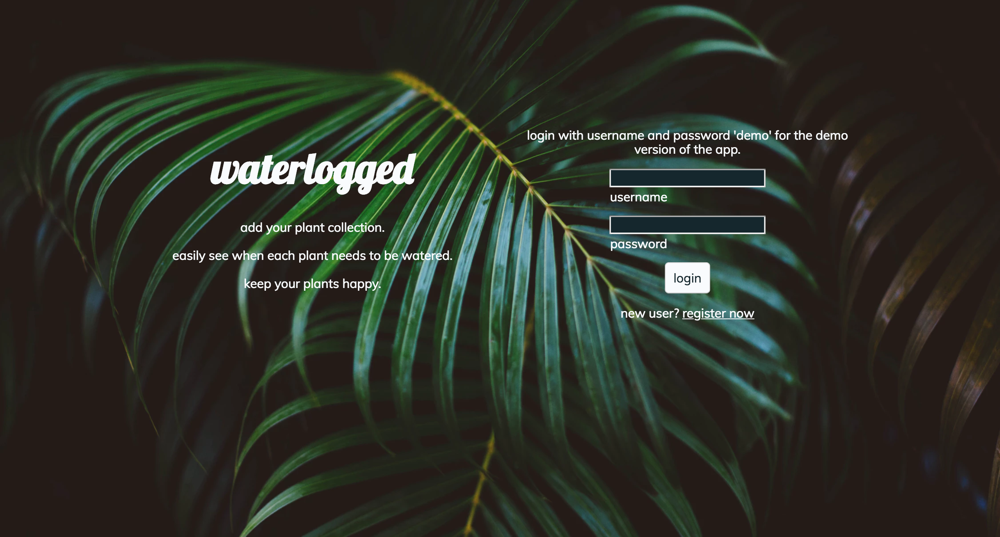
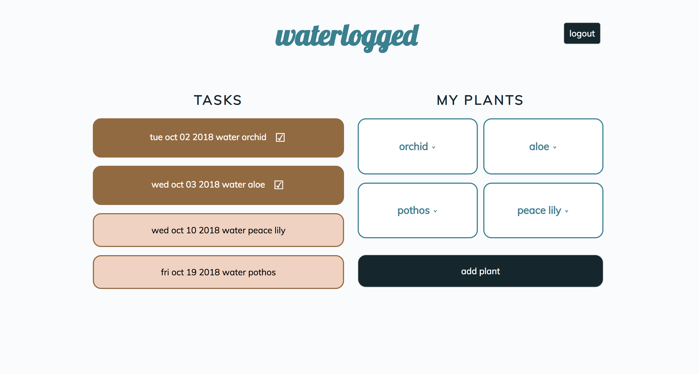
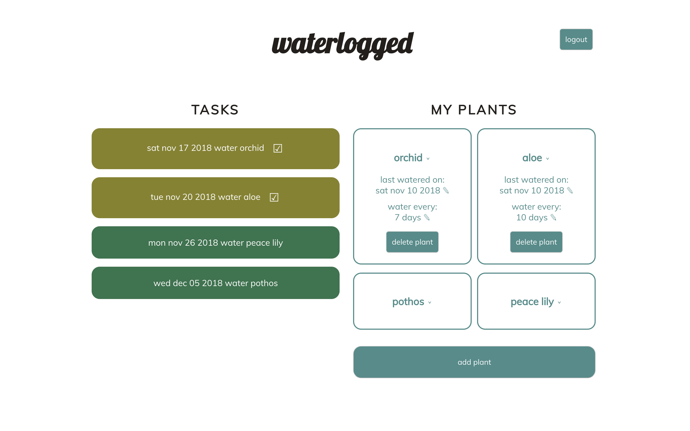

# Waterlogged
A full stack Javascript application that helps users track their plant collection and watering schedules. Supports CRUD operations:
* Create - Add plants to collection
* Read - View plants and when they are due for watering
* Update - Record when plants are watered or change watering frequency
* Delete - Delete plants from collection

## Demo
[Live Demo](https://sheltered-plateau-93284.herokuapp.com/)

## Built With
### Front End
* HTML
* CSS
* JavaScript
* jQuery

### Back End
* Node.js
* MongoDB
* Mongoose
* Mocha
* Chai
* Express
* Passport
* bcryptjs
* JWT Authentication

### DevOps
* TravisCI
* mLab
* Heroku

## Screenshots
Landing:

Main:

Details:

## API Documentation
### Login/Authentication
POST '/api/auth/login'
* Supply username and password in request header
* If successful, response body returns a valid JWT that expires in 7d and stores JWT and username in local storage

### Register User
POST '/api/users/'
* Adds new user to database
* Must supply username and password (at least 4 characters) in request header (first name and last name optional)
* If successful, response body returns a JSON object containing user details

### Add Plant
POST '/api/my-garden/'
* Adds single plant to database
* Must supply valid JWT Bearer Authentication in request header
* Must supply plant object in request body with username, plant name, and water frequency
* If successful, response body returns a JSON object containing new plant details

### Get All Plants by User
GET '/api/my-garden/:username'
* Retrieves all database records belonging to a specific user 
* Must supply username in request url
* Must supply valid JWT Bearer Authentication in request header
* If successful, response body returns all plant records belonging to user

### Update Plant
PUT '/api/my-garden/:id'
* Updates single plant record
* Must supply plant ID in request url
* Must supply valid JWT Bearer Authentication in request header
* Must supply plant object in request body with plant ID and updated field (last watered date or water frequency)
* If successful, server returns response status 204

### Delete Plant
DELETE '/api/my-garden/:id'
* Deletes single plant record
* Must supply plant ID in request url
* Must supply valid JWT Bearer Authentication in request header
* If successful, server returns response status 204
